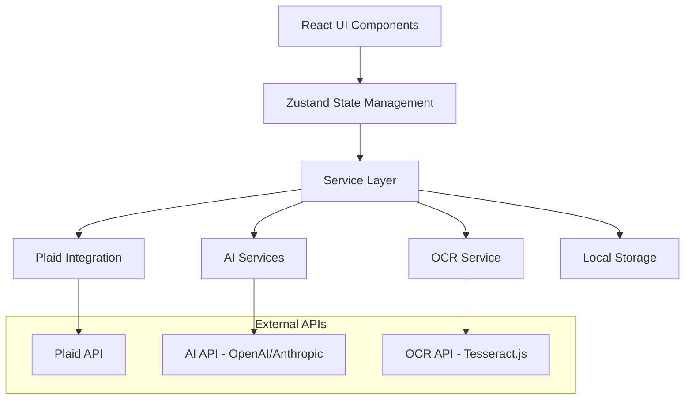

# Design Document: AI-Powered Personal Finance Manager

## Overview

This design document outlines the architecture and implementation approach for an AI-powered personal finance management application. The application will be built using React 18, TypeScript, and Vite as the build tool. The system integrates with Plaid for financial data aggregation, implements OCR for receipt scanning, and leverages AI for transaction categorization, insights, and predictions. The application follows a modular architecture with clear separation of concerns, ensuring maintainability and scalability.

## Architecture

### High-Level Architecture



### Technology Stack

- **Frontend Framework**: React 18 with TypeScript
- **Build Tool**: Vite
- **State Management**: Zustand (lightweight, TypeScript-friendly)
- **Styling**: Tailwind CSS for responsive design
- **Charts/Visualization**: Chart.js or Recharts
- **Financial Data**: Plaid API
- **AI Integration**: OpenAI API or Anthropic Claude API
- **OCR**: Tesseract.js (client-side OCR)
- **Storage**: Browser LocalStorage with encryption
- **Date Handling**: date-fns
- **Form Management**: React Hook Form with Zod validation

### Folder Structure

```
src/
├── components/           # Reusable UI components
│   ├── ui/              # Basic UI components (buttons, inputs, etc.)
│   ├── charts/          # Chart components
│   ├── forms/           # Form components
│   └── layout/          # Layout components
├── pages/               # Page components
├── services/            # Business logic and API integrations
│   ├── plaid/          # Plaid integration
│   ├── ai/             # AI service integrations
│   ├── ocr/            # OCR functionality
│   └── storage/        # Data persistence
├── stores/              # Zustand stores
├── types/               # TypeScript type definitions
├── utils/               # Utility functions
├── hooks/               # Custom React hooks
└── constants/           # Application constants
```

## Components and Interfaces

### Core Data Models

```typescript
interface Transaction {
  id: string;
  amount: number;
  date: Date;
  description: string;
  category: string;
  subcategory?: string;
  account_id?: string;
  plaid_transaction_id?: string;
  is_manual: boolean;
  is_hidden: boolean;
  receipt_image?: string;
  confidence_score?: number;
  created_at: Date;
  updated_at: Date;
}

interface Account {
  id: string;
  plaid_account_id?: string;
  name: string;
  type: 'checking' | 'savings' | 'credit' | 'investment';
  balance: number;
  institution_name?: string;
  last_synced?: Date;
  is_active: boolean;
}

interface Budget {
  id: string;
  category: string;
  amount: number;
  period: 'weekly' | 'monthly' | 'yearly';
  start_date: Date;
  current_spent: number;
  created_at: Date;
}

interface Investment {
  id: string;
  account_id: string;
  security_name: string;
  ticker_symbol?: string;
  quantity: number;
  price: number;
  value: number;
  type: 'stock' | 'bond' | 'etf' | 'mutual_fund' | 'cash';
  last_updated: Date;
}

interface AIInsight {
  id: string;
  type: 'spending_pattern' | 'anomaly' | 'recommendation' | 'prediction';
  title: string;
  description: string;
  confidence: number;
  category?: string;
  amount?: number;
  created_at: Date;
  is_read: boolean;
}
```

### Service Interfaces

```typescript
interface PlaidService {
  initializePlaid(): Promise<void>;
  connectAccount(): Promise<string>;
  syncTransactions(accessToken: string): Promise<Transaction[]>;
  getAccounts(accessToken: string): Promise<Account[]>;
  getInvestments(accessToken: string): Promise<Investment[]>;
  disconnectAccount(accessToken: string): Promise<void>;
}

interface AIService {
  categorizeTransaction(description: string, amount: number, plaidCategory?: string): Promise<{category: string, confidence: number}>;
  generateInsights(transactions: Transaction[]): Promise<AIInsight[]>;
  predictSpending(transactions: Transaction[], category?: string): Promise<{amount: number, confidence: number}>;
  analyzeBudgetGoal(budget: Budget, transactions: Transaction[]): Promise<{achievable: boolean, recommendation: string}>;
}

interface OCRService {
  processReceipt(imageFile: File): Promise<{
    merchant?: string;
    amount?: number;
    date?: Date;
    items?: Array<{name: string, amount: number}>;
    confidence: number;
  }>;
}

interface StorageService {
  saveTransactions(transactions: Transaction[]): Promise<void>;
  getTransactions(): Promise<Transaction[]>;
  saveAccounts(accounts: Account[]): Promise<void>;
  getAccounts(): Promise<Account[]>;
  saveBudgets(budgets: Budget[]): Promise<void>;
  getBudgets(): Promise<Budget[]>;
  saveSecureData(key: string, data: any): Promise<void>;
  getSecureData(key: string): Promise<any>;
}
```

### State Management Structure

```typescript
interface AppState {
  // Transaction state
  transactions: Transaction[];
  accounts: Account[];
  investments: Investment[];
  budgets: Budget[];
  insights: AIInsight[];
  
  // UI state
  isLoading: boolean;
  selectedDateRange: {start: Date, end: Date};
  selectedCategories: string[];
  
  // Actions
  addTransaction: (transaction: Omit<Transaction, 'id' | 'created_at' | 'updated_at'>) => void;
  updateTransaction: (id: string, updates: Partial<Transaction>) => void;
  deleteTransaction: (id: string) => void;
  syncPlaidData: () => Promise<void>;
  generateInsights: () => Promise<void>;
  createBudget: (budget: Omit<Budget, 'id' | 'created_at' | 'current_spent'>) => void;
}
```

## Data Models

### Transaction Flow

1. **Plaid Sync**: Transactions fetched from Plaid API are processed and stored with `is_manual: false`
2. **Manual Entry**: User-created transactions are stored with `is_manual: true`
3. **OCR Processing**: Receipt scans create transactions with extracted data and attached images
4. **AI Categorization**: All transactions are processed through AI for category assignment
5. **Budget Tracking**: Transactions update relevant budget spending totals

### Data Relationships

- Transactions belong to Accounts (optional for manual transactions)
- Budgets track spending across transaction categories
- Investments belong to investment Accounts
- AI Insights are generated from transaction patterns
- Receipt images are linked to specific transactions

### Data Validation

```typescript
const TransactionSchema = z.object({
  amount: z.number().min(0.01),
  date: z.date().max(new Date()),
  description: z.string().min(1).max(255),
  category: z.string().min(1),
  account_id: z.string().optional(),
  is_manual: z.boolean(),
});

const BudgetSchema = z.object({
  category: z.string().min(1),
  amount: z.number().min(0.01),
  period: z.enum(['weekly', 'monthly', 'yearly']),
  start_date: z.date(),
});
```

## Error Handling

### Error Types and Handling Strategy

```typescript
enum ErrorType {
  PLAID_CONNECTION = 'plaid_connection',
  AI_SERVICE = 'ai_service',
  OCR_PROCESSING = 'ocr_processing',
  STORAGE = 'storage',
  VALIDATION = 'validation',
  NETWORK = 'network'
}

interface AppError {
  type: ErrorType;
  message: string;
  details?: any;
  timestamp: Date;
  recoverable: boolean;
}
```

### Error Handling Patterns

1. **Plaid Errors**: Retry with exponential backoff, fallback to manual entry
2. **AI Service Errors**: Graceful degradation, allow manual categorization
3. **OCR Errors**: Fallback to manual transaction entry, retain image
4. **Storage Errors**: Show user notification, prevent data loss
5. **Network Errors**: Offline mode with sync when connection restored

### User-Friendly Error Messages

- Plaid connection issues: "Unable to sync bank data. Please check your connection and try again."
- AI service unavailable: "Smart categorization is temporarily unavailable. You can manually assign categories."
- OCR processing failed: "Couldn't read the receipt. Please enter the transaction details manually."

## Testing Strategy

### Unit Testing

- **Services**: Test all service methods with mocked dependencies
- **Utilities**: Test data transformation and validation functions
- **Hooks**: Test custom React hooks with React Testing Library
- **Components**: Test component rendering and user interactions

### Integration Testing

- **Plaid Integration**: Test account connection and data sync flows
- **AI Service Integration**: Test categorization and insight generation
- **OCR Processing**: Test receipt scanning with sample images
- **Storage Operations**: Test data persistence and retrieval

### End-to-End Testing

- **User Workflows**: Test complete user journeys from account setup to insights
- **Data Sync**: Test Plaid sync and manual transaction workflows
- **Budget Management**: Test budget creation and tracking
- **Receipt Scanning**: Test complete OCR to transaction creation flow

### Testing Tools

- **Unit/Integration**: Vitest with React Testing Library
- **E2E**: Playwright or Cypress
- **Mocking**: MSW (Mock Service Worker) for API mocking
- **Coverage**: Built-in Vitest coverage reporting

### Test Data Strategy

- Mock Plaid responses with realistic transaction data
- Sample receipt images for OCR testing
- Predefined AI responses for consistent testing
- Test databases with various financial scenarios

## Security Considerations

### Data Protection

1. **Plaid Access Tokens**: Encrypted before storage using Web Crypto API
2. **Sensitive Data**: All financial data encrypted in local storage
3. **API Keys**: Environment variables, never committed to code
4. **User Privacy**: No sensitive data logged or transmitted unnecessarily

### Security Implementation

```typescript
class SecurityService {
  private static async encrypt(data: string): Promise<string> {
    const key = await window.crypto.subtle.generateKey(
      { name: 'AES-GCM', length: 256 },
      false,
      ['encrypt', 'decrypt']
    );
    // Implementation details...
  }
  
  private static async decrypt(encryptedData: string): Promise<string> {
    // Implementation details...
  }
}
```

### Compliance Considerations

- Follow Plaid security best practices
- Implement proper token management and rotation
- Ensure data minimization principles
- Provide clear privacy policy and data handling information

## Performance Optimization

### Data Management

- Implement pagination for large transaction lists
- Use virtual scrolling for performance with many transactions
- Lazy load historical data beyond 90 days
- Implement efficient search and filtering

### AI Service Optimization

- Batch AI requests when possible
- Cache AI categorization results
- Implement request debouncing for real-time features
- Use optimistic updates for better UX

### Storage Optimization

- Implement data compression for large datasets
- Use IndexedDB for better performance with large amounts of data
- Implement data cleanup for old, unused records
- Optimize query patterns for better retrieval performance

### UI Performance

- Use React.memo for expensive components
- Implement proper key props for list rendering
- Use Suspense and lazy loading for code splitting
- Optimize chart rendering with data sampling for large datasets 