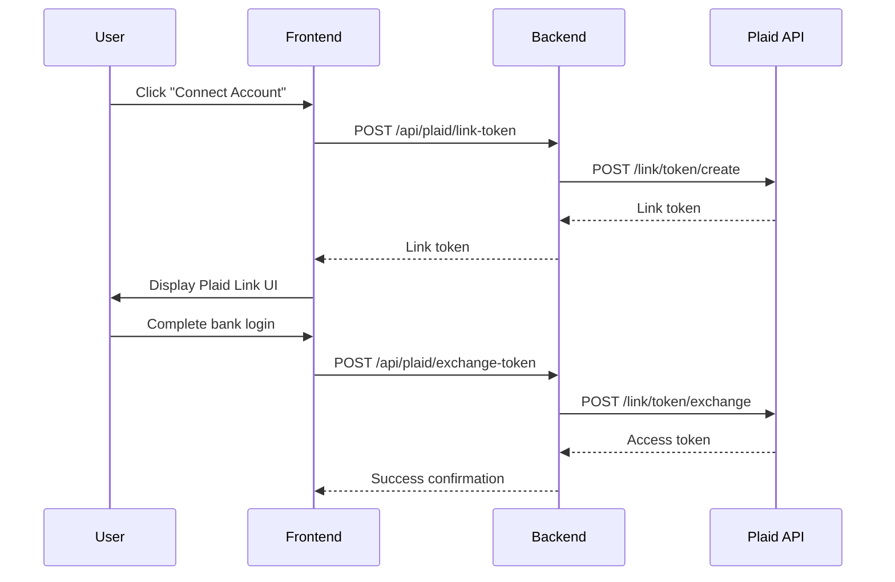
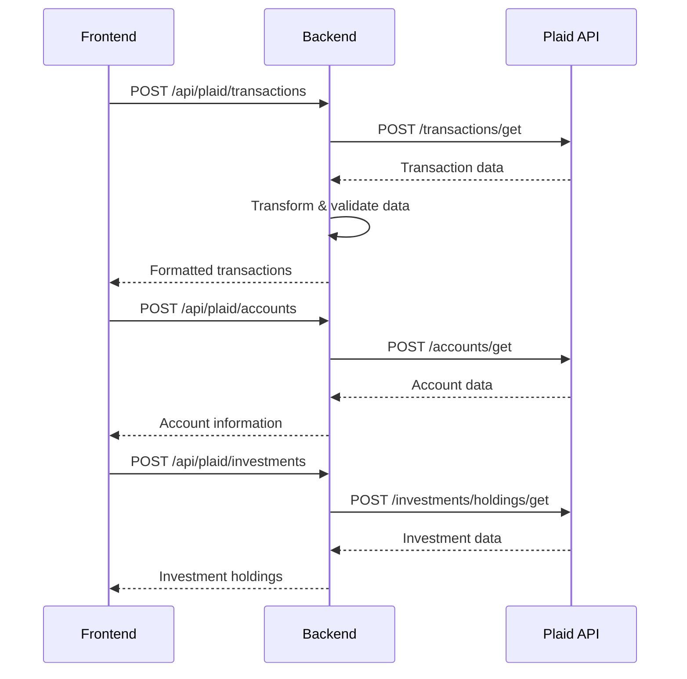

# Plaid Integration Documentation

## Overview

This document provides comprehensive information about the Plaid integration in the AI Finance Manager application, including configuration, testing, and API endpoints.

## Architecture

The Plaid integration follows a secure client-server architecture:

```
Frontend (React) → Backend (Node.js) → Plaid API
```

- **Frontend**: Handles Plaid Link UI and user interactions
- **Backend**: Securely manages Plaid API calls and credentials
- **Plaid API**: Provides financial data from connected institutions

## Environment Configuration

### Sandbox Environment (Testing)

The application is configured to use Plaid's sandbox environment for development and testing.

#### Frontend Configuration (`.env`)
```env
# Plaid Configuration - Sandbox Environment
VITE_PLAID_CLIENT_ID=6749ef2ed74216001aa5b99d
VITE_PLAID_ENV=sandbox
VITE_API_BASE_URL=http://localhost:7777/api
```

#### Backend Configuration (`backend/.env`)
```env
# Plaid Configuration - Sandbox Environment
PLAID_CLIENT_ID=6749ef2ed74216001aa5b99d
PLAID_SECRET=466dd340e03567184f38d1b5899bd1
PLAID_ENV=sandbox

# Server Configuration
PORT=7777
NODE_ENV=development
```

## API Endpoints and URLs

### Frontend to Backend Communication

The frontend communicates with the local backend server:

| Endpoint | Method | Purpose |
|----------|--------|---------|
| `http://localhost:7777/api/plaid/link-token` | POST | Create Plaid Link token |
| `http://localhost:7777/api/plaid/exchange-token` | POST | Exchange public token for access token |
| `http://localhost:7777/api/plaid/accounts` | POST | Fetch account information |
| `http://localhost:7777/api/plaid/transactions` | POST | Fetch transaction data |
| `http://localhost:7777/api/plaid/investments` | POST | Fetch investment holdings |
| `http://localhost:7777/api/plaid/liabilities` | POST | Fetch liability information |
| `http://localhost:7777/api/plaid/remove-item` | POST | Disconnect account |

### Backend to Plaid API Communication

The backend communicates with Plaid's sandbox environment:

**Base URL**: `https://sandbox.plaid.com`

| Endpoint | Method | Purpose |
|----------|--------|---------|
| `/link/token/create` | POST | Create Link token for Plaid Link |
| `/link/token/exchange` | POST | Exchange public token for access token |
| `/accounts/get` | POST | Retrieve account information |
| `/transactions/get` | POST | Retrieve transaction data |
| `/investments/holdings/get` | POST | Retrieve investment holdings |
| `/liabilities/get` | POST | Retrieve liability information |
| `/item/remove` | POST | Remove/disconnect item |
| `/item/get` | POST | Get item status |
| `/transactions/refresh` | POST | Force transaction refresh |

## Data Flow

### 1. Account Connection Flow



### 2. Data Synchronization Flow



## Testing Configuration

### Sandbox Environment Features

Plaid's sandbox environment provides:

- **Mock Financial Institutions**: Test with fake banks like "First Platypus Bank"
- **Simulated Data**: Realistic but fake financial data
- **No Real Credentials**: Safe testing without real bank information
- **Predictable Responses**: Consistent data for testing scenarios

### Test Credentials

For Plaid Link testing in sandbox, you can use these test credentials:

- **Username**: `user_good`
- **Password**: `pass_good`

### Available Test Institutions

The sandbox provides various test institutions:
- First Platypus Bank
- Tartan Bank
- Houndstooth Bank
- And many others

## Implementation Details

### Frontend Service (`src/services/plaid/PlaidService.ts`)

Key features:
- **Real Backend Integration**: All API calls go through the backend
- **Token Management**: Secure storage and validation of access tokens
- **Data Transformation**: Converts Plaid data to application format
- **Error Handling**: Comprehensive error handling with retry logic
- **Deduplication**: Smart transaction deduplication and update detection

### Backend Service (`backend/services/plaidService.js`)

Key features:
- **Secure API Calls**: Direct communication with Plaid API
- **Credential Management**: Secure handling of Plaid credentials
- **Data Validation**: Server-side validation of Plaid responses
- **Error Handling**: Proper error handling and user-friendly messages

## Security Considerations

### Credential Management

- **Client ID**: Public identifier, safe to expose in frontend
- **Secret Key**: Private credential, only stored in backend
- **Access Tokens**: Securely stored and validated
- **Environment Variables**: All sensitive data in environment files

### Data Protection

- **HTTPS**: All Plaid API calls use HTTPS
- **Token Validation**: Regular validation of access tokens
- **Secure Storage**: Encrypted storage of sensitive data
- **CORS Configuration**: Proper CORS setup for security

## Error Handling

### Common Error Types

| Error Type | Description | Resolution |
|------------|-------------|------------|
| `INVALID_CREDENTIALS` | Wrong login credentials | User needs to re-enter credentials |
| `INSTITUTION_ERROR` | Bank temporarily unavailable | Retry later |
| `RATE_LIMIT_EXCEEDED` | Too many requests | Wait and retry |
| `ITEM_LOGIN_REQUIRED` | Re-authentication needed | User needs to reconnect |

### Error Recovery

The system implements:
- **Exponential Backoff**: Automatic retry with increasing delays
- **User-Friendly Messages**: Clear error messages for users
- **Graceful Degradation**: Partial functionality when some services fail
- **Token Refresh**: Automatic token refresh when possible

## Monitoring and Debugging

### Logging

The system logs:
- API request/response cycles
- Error conditions and recovery attempts
- Performance metrics
- User interaction events

### Health Checks

Available endpoints:
- `GET /health`: Backend health status
- Token validation endpoints
- Connection status checks

## Production Deployment

### Environment Migration

To move from sandbox to production:

1. **Update Environment Variables**:
   ```env
   PLAID_ENV=production
   VITE_PLAID_ENV=production
   ```

2. **Obtain Production Credentials**:
   - Apply for Plaid production access
   - Update `PLAID_CLIENT_ID` and `PLAID_SECRET`

3. **Configure Webhooks**:
   - Set up production webhook endpoints
   - Update `PLAID_WEBHOOK_URL`

4. **Security Hardening**:
   - Use proper SSL certificates
   - Implement rate limiting
   - Set up monitoring and alerting

### Production URLs

When deployed to production, Plaid API calls will use:
- **Base URL**: `https://production.plaid.com`
- All endpoints remain the same, just different base URL

## Troubleshooting

### Common Issues

1. **Backend Connection Failed**
   - Ensure backend is running on port 7777
   - Check `VITE_API_BASE_URL` configuration

2. **Plaid API Errors**
   - Verify `PLAID_CLIENT_ID` and `PLAID_SECRET`
   - Check Plaid environment configuration

3. **Token Exchange Failures**
   - Ensure proper error handling in frontend
   - Check backend logs for detailed errors

4. **Data Sync Issues**
   - Verify access token validity
   - Check for rate limiting
   - Review transaction date ranges

### Debug Commands

```bash
# Check backend health
curl http://localhost:7777/health

# Test Plaid link token creation
curl -X POST http://localhost:7777/api/plaid/link-token \
  -H "Content-Type: application/json" \
  -d '{"user_id":"test-user"}'
```

## Additional Resources

- [Plaid API Documentation](https://plaid.com/docs/)
- [Plaid Sandbox Guide](https://plaid.com/docs/sandbox/)
- [React Plaid Link Documentation](https://github.com/plaid/react-plaid-link)
- [Plaid Node.js SDK](https://github.com/plaid/plaid-node)