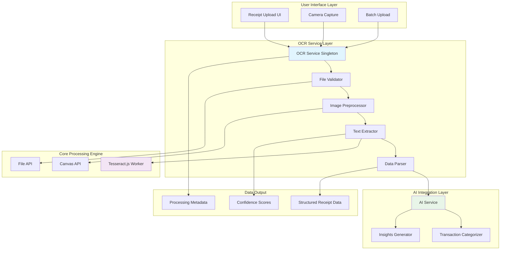
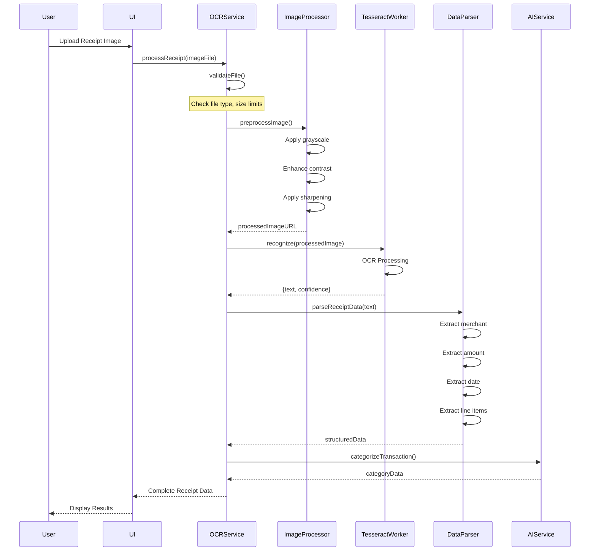
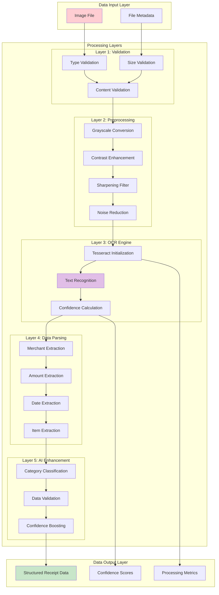
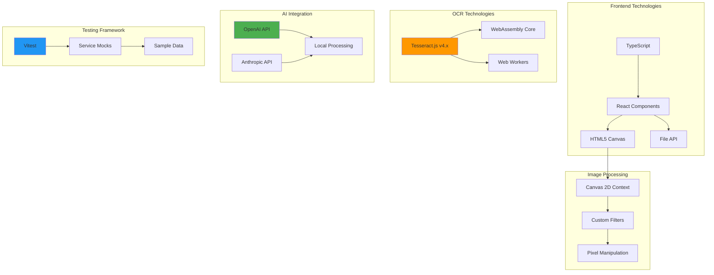
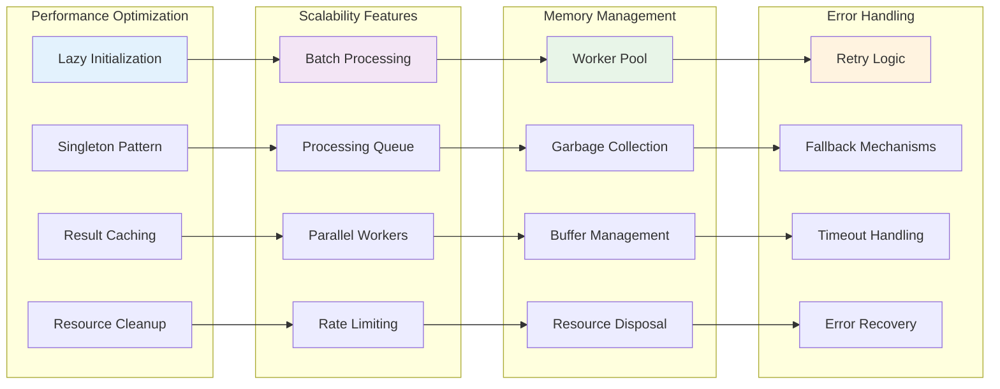
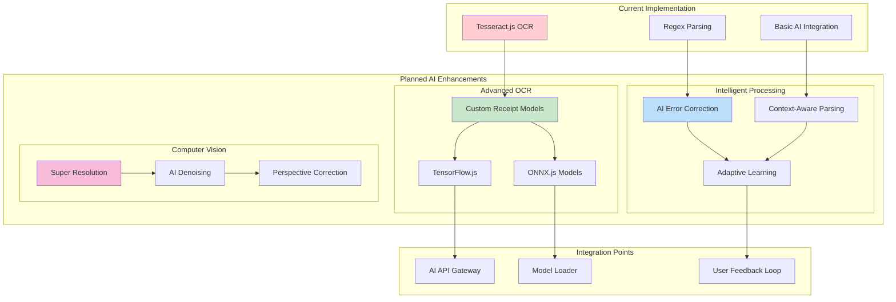
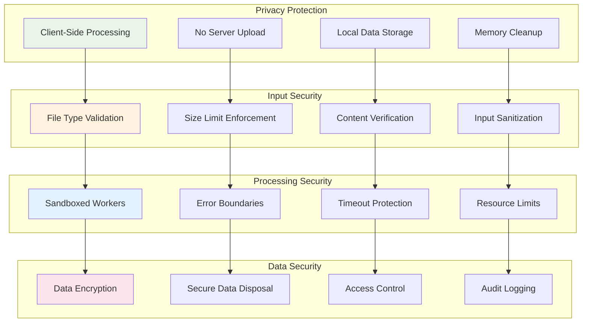
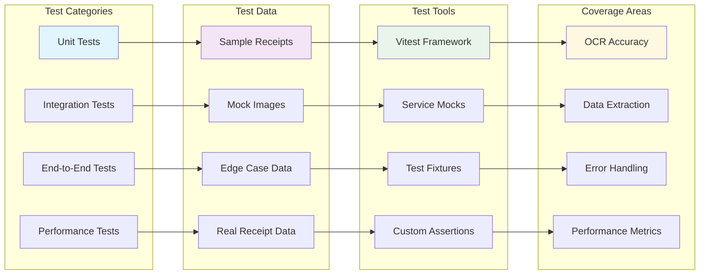

# OCR System Architecture Diagram

## High-Level Architecture

## Detailed Processing Pipeline

## Component Interaction Flow

```mermaid
flowchart LR
    subgraph "Input Processing"
        A[Image File] --> B[File Validation]
        B --> C[Size Check < 10MB]
        C --> D[Type Check: image/*]
    end
    
    subgraph "Image Enhancement"
        D --> E[Load to Canvas]
        E --> F[Convert to Grayscale]
        F --> G[Enhance Contrast 1.5x]
        G --> H[Apply Sharpening]
        H --> I[Optional Noise Reduction]
    end
    
    subgraph "OCR Processing"
        I --> J[Tesseract Worker]
        J --> K[Character Recognition]
        K --> L[Confidence Scoring]
        L --> M[Raw Text Output]
    end
    
    subgraph "Data Extraction"
        M --> N[Merchant Pattern Matching]
        M --> O[Amount Pattern Matching]
        M --> P[Date Pattern Matching]
        M --> Q[Line Item Extraction]
    end
    
    subgraph "AI Enhancement"
        N --> R[AI Categorization]
        O --> S[Amount Validation]
        P --> T[Date Normalization]
        Q --> U[Item Classification]
    end
    
    subgraph "Output"
        R --> V[Structured Receipt Data]
        S --> V
        T --> V
        U --> V
        L --> W[Confidence Metrics]
        V --> X[Final Result]
        W --> X
    end
    
    style A fill:#ffeb3b
    style J fill:#9c27b0
    style R fill:#4caf50
    style X fill:#2196f3
```

## Data Flow Architecture

## Technology Stack Visualization

## Performance and Scalability Architecture

## Future AI Enhancement Architecture

## Security and Privacy Architecture

## Testing Architecture

This architecture documentation provides a comprehensive visual representation of the OCR system's structure, data flow, and future enhancement possibilities. The diagrams illustrate how the system maintains privacy through client-side processing while providing robust OCR capabilities with AI integration potential.